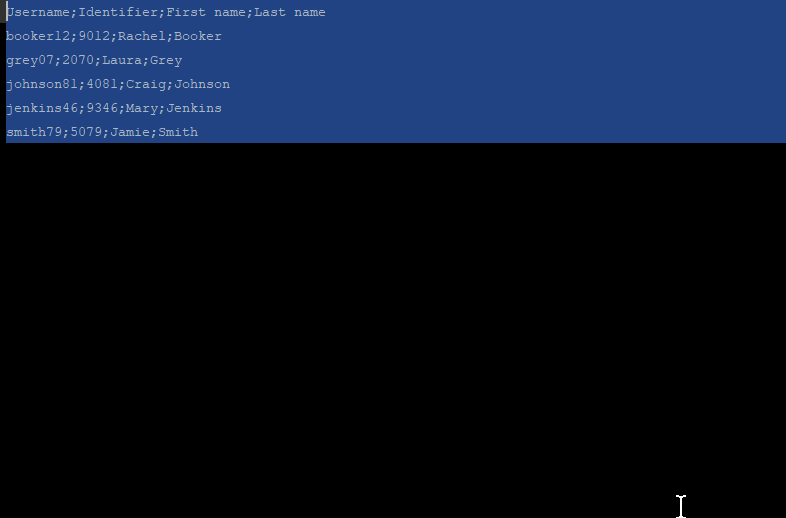

String Manipulation [![Donate][badge-paypal-img]][badge-paypal]
==================
IntelliJ plugin - https://plugins.jetbrains.com/plugin/2162 

Provides actions for text manipulation:

    

        Switch case:
        <ul>
            <li>Switch case (camelCase, kebab-lowercase, KEBAB-UPPERCASE, snake_case, SCREAMING_SNAKE_CASE, dot.case,
					words lowercase, First word capitalized, Words Capitalized, PascalCase)
            </li>
               <li>Toggle: SCREAMING__SNAKE__CASE / camelCase</li>
               <li>Toggle: snake__case / camelCase</li>
               <li>Toggle: kebab-case / snake__case</li>
               <li>Toggle: kebab-case / camelCase</li>
               <li>Toggle: dot.case / camelCase</li>
               <li>Toggle: PascalCase / camelCase</li>
               <li>Toggle: lowercase words / camelCase</li>
               <li>Toggle: First word capitalized / camelCase</li>
               <li>Toggle: Capitalized Words / camelCase</li>
               <li>To camelCase</li>
               <li>Capitalize</li>
               <li>To lower case</li>
            <li>To UPPER CASE</li>
            <li>Invert case</li>
        </ul>
- 'Switch case' action can be customized, or new ones can be added in settings 
- when nothing is selected, then either nothing or a whole line or a particular element is selected (report an issue if you find something to improve, each file type needs its own implementation to work flawlessly)</li>
    

    

        Un/Escape:
        <ul>
            <li>Un/Escape selected Java text</li>
            <li>Un/Escape selected JavaScript text</li>
            <li>Un/Escape selected HTML text</li>
            <li>Un/Escape selected JSON text</li>
            <li>Un/Escape selected XML text</li>
            <li>Un/Escape selected SQL text</li>
            <li>Un/Escape selected PHP text</li>
            <li>Convert diacritics (accents) to ASCII</li>
            <li>Convert non-ASCII to escaped Unicode</li>
            <li>Convert escaped Unicode to String</li>
        </ul>
    

    

        Encode/Decode:
        <ul>
            <li>Encode selected text to MD5 Hex16</li>
            <li>De/Encode selected text as URL</li>
            <li>De/Encode selected text to Base64</li>
            <li>De/Encode selected text to Hex</li>
    </ul>
    

    

        Increment/Decrement:
        <ul>
            <li>Increment/decrement all numbers found.</li>
            <li>Duplicate line and increment/decrement all numbers found.</li>	
            <li>Create sequence - Keep first number, replace all other by incrementing</li>	
            <li>Increment duplicate numbers</li>	
        </ul>
    

    

        Sort with natural order or Collator:
        <ul>
            <li>Reversing order of lines</li>
            <li>Shuffle lines</li>
            <li>Sort case-sensitive A-z</li>
            <li>Sort case-sensitive z-A</li>
            <li>Sort case-insensitive A-Z</li>
            <li>Sort case-insensitive Z-A</li>
            <li>Sort line length asc., desc.</li>
            <li>Sort hexadecimally</li>
            <li>Sort lines by subselection - only one selection/caret per line is handled</li>
            <li>Sort tokens (delimited text)</li>
	    <li><a href="https://github.com/krasa/StringManipulation/wiki/Hiarchical-sort/" >Hiearchical sort</a></li>
        </ul>
    

    

        Align:
        <ul>
            <li>Align carets/selections into a vertical line by inserting spaces</li>
            <li>Format selected text to columns/table by a chosen separator/delimiter and sort by columns</li>
            <li>Align text to left/center/right</li>
        </ul>
    

    

        Filter/Remove/Trim...:
        <ul>
            <li>Grep selected text, All lines not matching input text wil be removed.
                (Does not work in column mode)
            </li>
            <li>Inverted Grep</li>
            <li>Trim selected text</li>
            <li>Trim all spaces in selected text</li>
            <li>Remove all spaces in selected text</li>
            <li>Remove duplicate lines</li>
            <li>Keep only duplicate lines</li>
            <li>Remove empty lines</li>
            <li>Remove all newlines</li>
        </ul>
    

    

        Other:
        <ul>
            <li>Reverse Letters</li>
            <li>Swap Characters/Selections/Lines/Tokens</li>
            <li>Wrap or shift double quotes to single quotes to backticks</li>
            <li>Swap between double quotes and single quotes</li>
            <li>Switch file path separators: Windows&lt;-&gt;UNIX</li>
        </ul>
    

    
Actions are available under Edit menu, or via the shortcut "alt M" and "alt shift M".
			 You can setup your own shortcuts for better usability.
			 Popup can be customized in File | Settings | Appearance & Behavior | Menus and Toolbars.
    

------

YourKit supports open source projects with its full-featured Java Profiler.
YourKit, LLC is the creator of [YourKit Java Profiler](https://www.yourkit.com/java/profiler/)
and [YourKit .NET Profiler](https://www.yourkit.com/.net/profiler/),
innovative and intelligent tools for profiling Java and .NET applications.

[badge-paypal-img]:       https://img.shields.io/badge/donate-paypal-green.svg
[badge-paypal]:           https://www.paypal.me/VojtechKrasa
