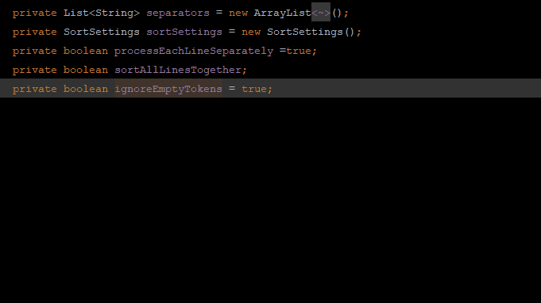
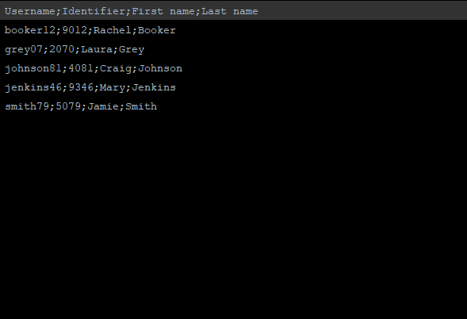

String
Manipulation [![Donate][badge-paypal-img]][badge-paypal] 

==================

IntelliJ plugin - https://plugins.jetbrains.com/plugin/2162

***    

## Main features

Provides actions for text manipulation:

    

        Switch case:
        <ul>
            <li>Switch case (camelCase, kebab-lowercase, KEBAB-UPPERCASE, snake_case, SCREAMING_SNAKE_CASE, dot.case,
					words lowercase, First word capitalized, Words Capitalized, PascalCase)
            </li>
               <li>Toggle: SCREAMING_SNAKE_CASE / camelCase</li>
               <li>Toggle: snake_case / camelCase</li>
               <li>Toggle: kebab-case / snake_case</li>
               <li>Toggle: kebab-case / camelCase</li>
               <li>Toggle: dot.case / camelCase</li>
               <li>Toggle: PascalCase / camelCase</li>
               <li>Toggle: lowercase words / camelCase</li>
               <li>Toggle: First word capitalized / camelCase</li>
               <li>Toggle: Capitalized Words / camelCase</li>
               <li>To camelCase</li>
               <li>To snake_case</li>
               <li>To kebab-case</li>
               <li>To SCREAMING_SNAKE_CASE</li>
               <li>To Capitalized_Snake_Case</li>
               <li>Capitalize</li>
               <li>To lower case</li>
            <li>To UPPER CASE</li>
            <li>Invert case</li>
            <li>To Spring Boot System Env Variable</li>
        </ul>
- 'Switch case' action can be customized, or new ones can be added in settings 
- when nothing is selected, then either nothing or a whole line or a particular element is selected (report an issue if you find something to improve, each file type needs its own implementation to work flawlessly)</li>
    

    

        Un/Escape:
        <ul>
            <li>Un/Escape selected Java text</li>
            <li>Un/Escape selected JavaScript text</li>
            <li>Un/Escape selected C# text (regular, verbatim, interpolated)</li>
            <li>Un/Escape selected HTML text</li>
            <li>Un/Escape selected JSON text</li>
            <li>Un/Escape selected XML text</li>
            <li>Un/Escape selected SQL text</li>
            <li>Un/Escape selected PHP text</li>
            <li>Convert diacritics (accents) to ASCII</li>
            <li>Convert non-ASCII to escaped Unicode</li>
            <li>Convert escaped Unicode to String</li>
            <li>Unicode normalization (NFD, NFC, NFKC, NFKD)</li>
        </ul>
    

    

        Encode/Decode:
        <ul>
            <li>Encode selected text to MD5 Hex</li>
            <li>Encode selected text to SHA-1 Hex</li>
            <li>Encode selected text to SHA-256 Hex</li>
            <li>Encode selected text to SHA-512 Hex</li>
            <li>Encode selected text to SHA3-256 Hex</li>
            <li>Encode selected text to SHA3-512 Hex</li>
            <li>De/Encode selected text as URL</li>
            <li>De/Encode selected text to Base64</li>           
            <li>De/Encode selected text to Hex</li>
            <li>ISO Timestamp to Epoch Milliseconds</li>
            <li>Epoch Milliseconds to ISO Timestamp</li>
    </ul>
    

    

        Increment/Decrement:
        <ul>
            <li>Increment/decrement all numbers found.</li>
            <li>Duplicate selection and increment/decrement all numbers found.</li>	
            <li>Create sequence - Keep first number, replace all other by incrementing</li>	
            <li>Increment duplicate numbers</li>	
        </ul>
    

    

        Sort with natural order or Collator:
        <ul>
            <li>Reversing order of lines</li>
            <li>Shuffle lines</li>
            <li>Sort case-sensitive A-z</li>
            <li>Sort case-sensitive z-A</li>
            <li>Sort case-insensitive A-Z</li>
            <li>Sort case-insensitive Z-A</li>
            <li>Sort line length asc., desc.</li>
            <li>Sort hexadecimally</li>
            <li>Sort lines by subselection - only one selection/caret per line is handled</li>
            <li>Sort tokens (delimited text)</li>
            <li><a href="https://github.com/krasa/StringManipulation/wiki/Hierarchical-sort/">Hierarchical sort</a></li>
            <li>Shuffle Characters</li>
            <li>JSON sort</li>
       </ul>
    

    

        Align:
        <ul>
            <li>Align carets/selections into a vertical line by inserting spaces</li>
            <li>Format selected text to columns/table by a chosen separator/delimiter and sort by columns</li>
            <li>Align text to left/center/right</li>
        </ul>
    

    

        Filter/Remove/Trim/Convert...:
        <ul>
            <li>Grep</li>
            <li>Inverted Grep</li>
            <li>Group by Grep - matched lines will be separated from not matched</li>
            <li>Trim</li>
            <li>Trim Trailing</li>
            <li>Trim Leading</li>
            <li>Replace whitespaces with a single space char</li>
            <li>Remove all spaces</li>
            <li>Remove duplicates - supports multicaret subselection</li>
            <li>Keep only duplicate lines</li>
            <li>Remove empty lines</li>
            <li>Remove consecutive empty lines</li>
            <li>Remove all newlines</li>
            <li>Minify JSON</li>
            <li>Convert Between JSON and YAML</li>
   </ul>
    

    

        Other:
        <ul>
            <li>Reverse Letters</li>
            <li>Swap Words</li>
            <li>Swap Characters/Selections/Lines/Tokens</li>
            <li>Wrap or shift double quotes to single quotes to backticks</li>
            <li>Swap between double quotes and single quotes</li>
            <li>Straighten/Educate quotes</li>
            <li>Switch file path separators: Windows&lt;-&gt;UNIX</li>
            <li>Select All Occurrences For All Carets</li>
            <li>Duplicate Line or Selection And Replace</li>
            <li>Extend Selection in Different "CamelHumps" Mode</li>
        </ul>
    

    
Actions are available under Edit menu, or via the shortcut "alt M" and "alt shift M".
			 You can setup your own shortcuts for better usability.
			 Popup can be customized in File | Settings | Appearance & Behavior | Menus and Toolbars.
    

------

Privacy Notice: No personal data is collected and no source code is transmitted to any server

------

YourKit supports open source projects with its full-featured Java Profiler. YourKit, LLC is the creator
of [YourKit Java Profiler](https://www.yourkit.com/java/profiler/)
and [YourKit .NET Profiler](https://www.yourkit.com/.net/profiler/), innovative and intelligent tools for profiling Java
and .NET applications.

[badge-paypal-img]:       https://img.shields.io/badge/donate-paypal-green.svg

[badge-paypal]:           https://www.paypal.me/VojtechKrasa
